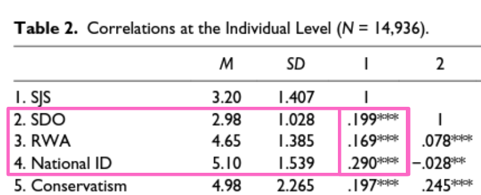
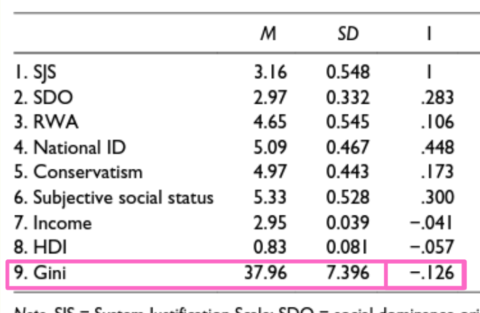
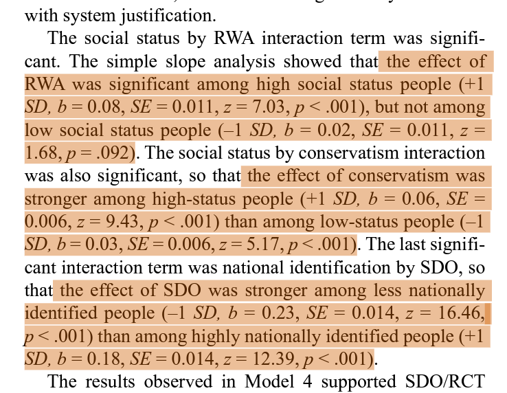
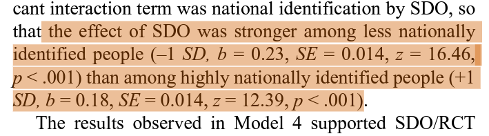
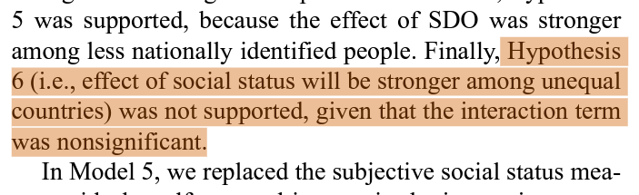
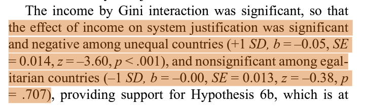
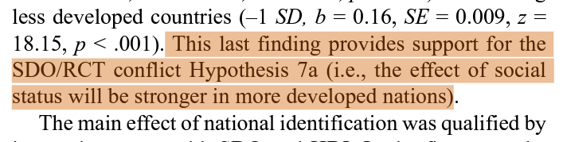
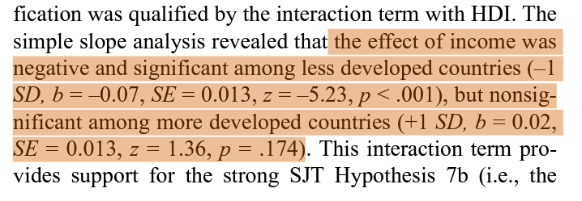

SDTとは？
Social Dominance Theory (SDT)とは、最も安定した社会とは、集団ベースのヒエラルキーに従って組織された社会であるとする理論である(引用)。SDTが、階層構造をもつ集団が最も安定していると主張する理由の一つが、正当化するイデオロギー(考え方)が集団の利益や行動を調整するからだとしている。SDTでは特に、地位の高い人物が地位の低い人物よりも現状の正当化するとしている。このような階層構造を好む程度を測る尺度として開発されたのが、Social Dominance Orientation(SDO)である。
SDOとは、ある集団が別の集団よりも優れていることを是とする程度を測定する尺度である(引用)。この尺度は文脈的要因よりも態度に依存しており(引用)、内的変数として考えられている。SDOは、アメリカにおける地位の高い集団で保守の程度やナショナリズムを予測する()。なお、SDTでは理論上、自分を含まない集団に対しても階層構造を好む。

SJTとは？
System Justification Theory (SJT)とは、SDTと同様、不平等なシステムがなぜ維持されるのかについて説明を試みる理論であり、「人間にはシステムを正当化する心的過程が本質的に存在する」としている理論である。システムを正当なものであると認知するバイアスは、自身の物質的関心(e.g., お金、食べ物)と矛盾していたとしても生じることが示されている()。SJTは、不利益を被る層が存在するようなシステム(そして自身がその不利益を被る層)であっても、それを肯定する事によって不平等なシステムは維持されるという立場を取る。

SDTとSJTは、何が違くてどちらが正しいのか？
SDTとSJTの最大の違いは、現状システムを肯定する人物の地位である。具体的には、SDTは地位の高い人物のほうがシステムを肯定するとし(System Justification)、SJTでは地位の低い人物のほうがシステムを肯定するとしている。例えば()は…

これまでの研究の限界と解決策
しかし、これまでの研究では経験的証拠、もしくは文化横断的な観測のどちらかが欠けており、現状の知見のみでは上記のような幅の広い仮説を検証できない。そこで本研究では、先行研究をより拡張し()、客観的尺度(economic status)と主観的尺度(psychological dispositions)を多様な文化で測定することで、SDTとSJTのどちらが理論的に妥当なのかを検証する。具体的には、客観的尺度として
- HDI(Human Development Indicator)
- Gini係数

主観的尺度として
- SJS(System Justification Scale)
- SDO
- RWA(Right-Wing Authoritarianism)
- National identification
- Consevatism
- Subjective socail status
  - 1~10の間で、あなたの社会的裕福さはどの位置ですか？
- Income
  - 年収を入力させ、後に国の収入と整合して10分位
- age
- gender

を用いた。
以上の測定項目を使って検証する仮説は、以下の7つである。(わかりやすさのために省略して訳している)
1. SDO、RWA及びConservatismは、SJSの増加を予測する。
2. Statusが高いとき…
   1. SDTが正しいならStatusはSJSの増加を予測し、
   2. SJTが正しいならStatusはSJSの減少を予測する。
3. Gini係数が高いとき…
   1. SDTが正しいならSJSの増加を予測し、
   2. SJTが正しいならSJSの減少を予測する。
4. Statusと正当化の交互作用の効果量は…
   1. SDTが正しいとき、High > Low であり、
   2. SJTがが正しいとき、Low > High である。
5. High Status(+1 S.D.)のとき、National IdentificationとSDO、RWA、Conservatismとの関係は弱くなる
   1. StatusとNational IDの交互作用
6. Gini係数とStatusの交互作用の効果量は…
   1. SDTが正しいなら平等を実現している社会のほうが大きく、
   2. SJTが正しいなら不平等な社会のほうが大きい。
      1. Gini係数が大きいほど、(収入が)平等な社会である
7. HDIとStatusの交互作用の効果量は…
   1. SDTが正しいなら先進国が大きく、
   2. SJTが正しいなら発展途上国が大きい。

補足
マルチレベル(階層的？)重回帰分析で分析している。しかし、高橋はまだ単なる重回帰分析しか知らず、マルチレベルは未習熟ですので誤解している可能性があります。また、Hypothesisに関する和訳もあっているか不安なので、あまりあてにせず聞いていただけると嬉しいです。

結果

仮説１(SDO、RWA及びConservatismは、SJSの増加を予測する)は支持された。

仮説2a(Statusが高いとき(SDTが正しいなら)StatusはSJSの増加を予測する)が支持された。

仮説3( Gini係数が高いとき、SJSの増加(SDT)もしくは減少(SJT)を予測する)は支持されなかった。
 

仮説4a(Statusと正当化の交互作用の効果量は(SDTが正しいとき)High-status > Low-status)が支持された。

仮説5(High Status(+1 S.D.)のとき、National IdentificationとSDO、RWA、Conservatismとの関係は弱くなる)は支持された

仮説6b( Gini係数とStatusの交互作用の効果量は(SJTが正しいなら)不平等な社会のほうが大きい)が支持された（？）。
Model 4では支持しないが、Model 5では支持する。
Model 4

Model 5

仮説7(HDIとStatusの交互作用の効果量は…)はどちらとも言えない？
Model7（最も当てはまりの良いモデル）

Model 8

高橋の感想

そうそう！こういうの、こういうの！な論文だった
この論文の面白さは特に、
1. どちらが妥当なのか(現実に即しているのか)を検証するようなWhichな問いである
2. 理論をもとに推論し、多文化で普遍的に主張できるように検証している

という２つにあると思います。理論で考えて仮説を立てて、後の研究が優れた理論を用いて推測できるようにする。こういうの論文こそが、科学を発展させるのだなとしみじみ思いました。

SDTは頑健な理論である
今までは「SJTめっちゃおもろい！SDTも興味深いけど、なんか惹かれないんだよなぁ…集団間の階層構造が好きかどうかでそんなに多くを語れるのかな？」と思っていました。しかし、この論文の序論を始めとして、本論文の結果を見てSDTの豊かさと現実の知見との整合性(e.g., 現状維持したいのは高地位の人である、という言われてみれば当たり前のこと)、理論の示唆する現象の魅力に驚かされました。もちろん、進化心理学ほどには頑健な理論ではないかもしれませんが、複雑な心理的仮定を置かずに様々な現象を説明できるのは優れた理論の証なんだなと。「次に書く論文は絶対にSDTとからめる！」という確かなモチベーションができました。ありがとうございます。