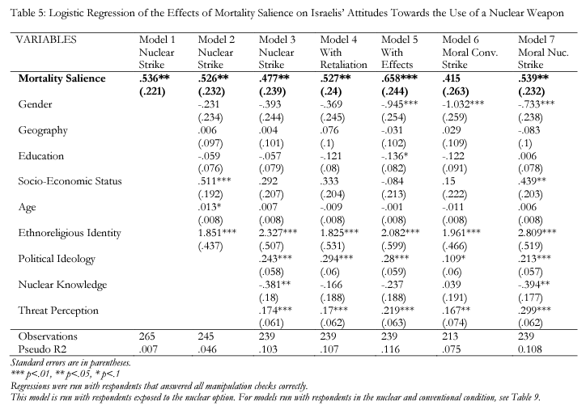
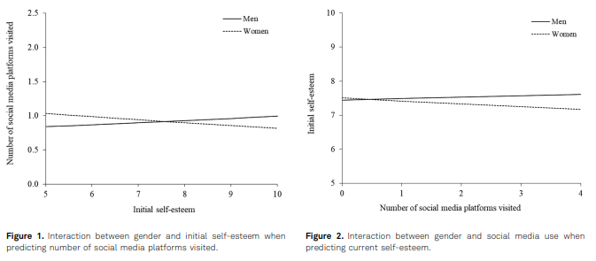
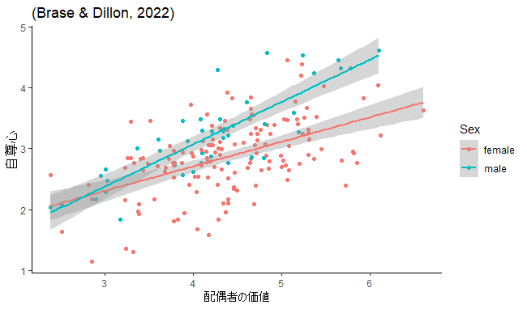

# TMTの最近の動向

コロナのパンデミックによる人々の行動変化を説明する理論として用いられている傾向
- TMTは未来への態度と不安を予測し、未来への態度と不安は(コロナのパンデミックに対する)予防行動を予測した（健康問題への応用可能性を主張）(Harkrider, 2022)
- ビッグデータ(Google Trends)をもちいてTMT理論に基づく行動を検証したところ、最初のCOVID-19患者が確認された後、死亡率顕著性、集団間対立、向社会的行動が有意に増加し、物質主義が有意に減少した(Chew, 2022)
  - ちなみに、高橋はビッグデータ解析否定派です
  - サンプルサイズが大きいと有意差が出やすい(p値が小さくなる)ため
- （TMTから推論した仮説を検証した結果）コロナのパンデミックによる死への不安は、就労者よりも日就労者のほうが大きかった(Shakil et al., 2022)
- パンデミック(死亡率が顕著)下での人々の反応を(Twitterから)分析した結果防衛反応が観測されたが、反応の種類は米国、英国、インドで異なっていた(Kwon & Park, 2022)

また外集団への攻撃態度の説明としても用いられている
- 死を思い出しやすい人は心的外傷後成長（PTG）を発現させると仮定し検証したが、有意な差は見られなかった(Rose & Shultz, 2022)
- TMTを発展させた理論を作って検証した。結果、死が顕在化されると核攻撃を支持しやすくなった(Horschig, 2022)
  - めちゃくちゃ高い相関出た
  - 

TMT（厳密にはMS処理による行動変容？）には良い面があるとする意見論文もあった
- TMTは確かに負の側面(差別、宗教的不寛容)もあるが、助け合ったり向社会的価値を受け入れるような側面もある（意見論文）(Burke et al., 2022)

しかし、メタ分析では一貫してTMTを支持していない
- メタ分析の結果、MS研究の検出力は非常に低かった(26%)(Chen et al., 2022)
  - 望ましいとされる検出力は80%
  - 検出力(β)：対立仮説が正しいとき、正しく対立仮説を採択できる可能性
- N=1,550、さらに研究デザインにおいて原著者を参加させても、TMTは再現されなかった(Klein et al., 2022)
  - 著者は誤検出or理解不足or存在しないのどれかだろうと述べている

ちなみに…
- 有意水準(α)：帰無仮説が正しいのに、誤って対立仮説を採択する可能性
  - 一般的には5%や1%だが、数学的根拠はない
  - 高橋は「有意傾向だった」と書いてる論文を見ると無性に腹が立ちます
    - 「有意傾向が見られた」＝「5%は下回ってないけど8%だから仮説は正しそうじゃない？」の意
- 有意水準αと検出力βはトレードオフですが、完全に連動するわけではありません

**いずれもTMTの存在を否定する内容**

# ソシオメーター理論の最近の動向

基礎研究よりも、現実問題の原因を特定・説明するための理論として用いられている
- 親のファビング、自尊心、不適応(maladaptive)認知を測定したら、親のファビング（スマホを見る、メールを返信するなどして、目の前の人を無視する行為）が不適応認知を媒介してIGD（インターネットゲーム障害）とを増加させていたが、自尊心は調整変数として機能していなかった(Shen et al., 2022)
  - 自尊心とIGDは関係していない可能性を示唆
- 過去も現在も関係なく、女性は自尊心が低いほど頻繁にSNSを利用していたが、男性は初期の自尊心の低さはSNSを利用しない程度を予測し、現在の自尊心の程度によってSNSの利用は変化しなかった（ただし、自尊心の安定性が低いと性差なくSNSの利用頻度が高くなった）(Miljeteig & Soest, 2022)
  - (女性でのみ)SNSの利用が自尊心を低下させ、自尊心の低下がSNS利用頻度を増加させるという相互作用関係が確認された
  - SNSによる悪影響は女性特有である可能性
  -  
- 女子大学生を対象に研究したところ、ボディイメージの悪さは過食障害を予測しており、自尊心と過食障害には正の相関があった(Abamara et al., 2022)
- 半構造化面接で調査した結果、環境と人間関係の両方に集中する程度がレジリエンスを高める動機になっていた(Kolb et al., 2022)
  - この研究について、高橋はよくわかってません（質的研究への理解が…）

ただし、基礎研究がやられていないというわけではない
- 異性からの拒絶は（非意識的にも、意識的にも）交際相手の価値、交際相手への期待、交際相手に対する行動傾向を減少させた(Zhang et al., 2015)
  - 自尊心のソシオメーターとしての役割は、非意識過程でも処理されていることを示唆
- 自尊心と配偶者価値の相関は女性よりも男性が強かった（男性における自尊心のソシオメーターの役割は配偶者の価値が多くを占める）(Brase & Dillon, 2022)
  - 自尊心自体だけでなく、自尊心の機能にも性差が見られる可能性
    

また個人差としての説明よりも、組織的な文脈で用いられている傾向
- （音声研究）声の質が悪いと自尊心は低い（声の質は悪い提案の認識を高め、結果仲間外れを招くから、声の質の自己認識を低めるだけじゃなくて評価も厳しくなってしまう（ソシオメーター理論の支持）(Ng et al., 2022)
- 構造方程式モデリングを用いて分析したところ、組織の社会化は同僚との関係を媒介して自尊心を増加させていた(Perinelli et al., 2022)
- 声の質の悪さは自尊心の低下をもたらす一方、自分の声を良くしたいというポジティブなモチベーションも増加させていた(Liu, 2022)

代表的な研究 or レビュー論文
- 状態自尊心は他者からの受容や拒絶と連動していた（社会的に受け入れられてる感覚は自尊心と強い相関があった）（ランダムな排除は自尊心低下しないが、個人的理由である場合は低下する）（特性自尊心は一般的に受容されてるかっていう程度と強い相関ある）(Leary et al., 1995)
  - JPSPに乗った論文
- 個人内レベルでは社会的受容は自尊心に影響及ぼし（クロスラグ分析）、個人間レベルでは人間関係の質と特性自尊心に正の相関があり、国際的なレベルでは（幸福感、個人主義、国内総生産、神経症を統制しても）友人と定期的に交流している国ほど自尊心のレベルは高かった(Denissen et al., 2008)
- ソシオメーター理論のレビュー論文（自尊心の定義と機能、ソシオメーターの定義と機能について論じている）(Liu & Zhang, 2016)