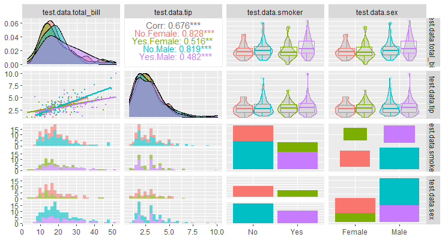

<!-- 
_class: title
headingDivider: 1
 -->
# STS、TMT、 そして進化心理
## 概要と最近の動向、関係性の紹介
# 目次
- [概念の定義、概要](#概念の定義概要)
  - [自尊心](#自尊心)
  - [ソシオメーター理論](#ソシオメーター理論)
  - [存在驚異管理理論](#存在驚異管理理論)
  - [進化心理学](#進化心理学)
- [TMTの最近の動向](#tmtの最近の動向)
- [ソシオメーター理論の最近の動向](#ソシオメーター理論の最近の動向)
- [ここで相談(今週の方針)](#ここで相談今週の方針)

# 概念の定義、概要
<!-- _class: section -->

<!-- class: slides -->
# 自尊心
自尊心(Self-esteem)とは、自分の価値について評価することである。
これは主観的な判断であり、
1. Global self-esteemとdomain-specific self-esteem
2. 状態自尊心と特性自尊心

に分かれる。
特に自尊心のシステムには即時的なものと長期的なものの２つが存在しており、それぞれが状態自尊心と特性自尊心に対応している。

# ソシオメーター理論
（自尊心の）ソシオメーター理論(Sociometer Theory of Self-esteem;STS)とは、
1. 「拒絶への反応システムを記述する代表的な理論の一つ」(宮崎・池上, 2011)であり、
2. 自尊心に影響を与えるものは、社会的受容と排斥である

とする理論である(レビューとして、Liu & Zhang, 2016)。

# ソシオメーター理論
STSでは自尊心それ自体が重要なのではなく、
<accent>自分が社会的に受容されていることのバロメーターとなる</accent>から
重要なのだとしている。

例えば、
- 私達の状態自尊心は他者の拒絶によって低下する。
- 自尊心の低下は関係が脅威にさらされていることを意味する。
- この信号によって関係修復や新たな関係の再構築への対処行動が動機づけられる。

# ソシオメーター理論
STSでは、この関係修復や関係構築の役割を担うのが自尊心であり、
- 自尊心は感情的内容を含む自己評価である
- （そのため、非意識的に働いている）

と仮定している(Leary & Baumeister, 2000)。
次のページでは、STSを支持する実験を紹介する。

# ソシオメーター理論
- Leary et al. (1995)の、状態自尊心は他者からの評価の高低によって変動することを示した実験
- Denissen et al. (2008)は、友人を訪問する頻度が平均的に高い国ほど自尊心の平均値も高いことを示した実験

なお、STSは人間には所属したいという基本的な欲求があることを前提としている。

 

# ソシオメーター理論
上記のような機能から、ソシオメーター理論は <accent>３つの特性 </accent>を持つと考えられる(Liu & Zhang, 2016)。
1. 社会的受容が危険にさらされているときに敏感に反応できるべきであること。
2. このシステムは非意識的なレベルで継続的に活動しているため、他のことをしていても関係の危機が検出されるはずであること。
3. 関係価値よりも関係危機に敏感であるべきであること
   1. 日常では、関係危機よりも関係価値状態のほうが長いため

 

# ソシオメーター理論
特に非意識的なレベルでの処理が可能になることによって、
社会的相互作用場面でも意識的な認知を用いなくても良いことは、
認知資源が限られていることからも <accent>非常に大きなメリット </accent>である。
- 実際、異性間の交際相手の選択において、異性から拒絶を経験したグループは非意識的なレベルでも交際相手の価値、交際相手への期待、交際相手に対する行動傾向を減少させた(Zhang et al., 2015)。

 

# 存在驚異管理理論
存在驚異管理理論(Terror management theory;TMT)とは、
 <accent>人にはなぜ自尊心や文化的世界観があるのか </accent>
に対する説明を試みている理論のことである(Greenberg et al., 1986)。
TMTによれば
- 文化的世界観は世界を秩序のあるもの
- 予測可能にする役割

を担っているという。

 

# 存在驚異管理理論
また自尊心は、文化的世界観の中でも、
 <accent>内化された文化的世界観 </accent>の(価値)基準を満たしたときの
主観的感覚であるとしている。
この理論を支持する実験としては、
- 死が顕在化されると、外集団成員への否定手的態度が促進されるを示した実験(Greenberg et al., 1995)

 

# 存在驚異管理理論
この理論から導かれる仮説で代表的なものとして、 <accent>文化的不安緩衝装置仮説 </accent>(Cultural Anxiety Buffer Hypothesis; CAB仮説)と <accent>存在驚異顕現化仮説 </accent>(Mortality Salience Hypothesis; MS仮説)がある。
- CAB仮説は「文化的世界観や自尊心が強いもの、また状態的に強化されている者は、死の予期から受ける驚異が小さい」(脇本, 2005)という仮説
- MS仮説は「死の驚異が高まる(MS処理を受ける)と、文化的不安緩衝装置に対する欲求が高まる」(脇本, 2005)という仮説

 

# 進化心理学
進化心理学(Evolutionary psychology)とは、
 <accent>進化論の考え方で人の心や行動を統一的に解明しようとする学問 </accent>
のことである。
これは人々の心の働きも行動傾向も、自然淘汰によって形作られたこと(進化論)を前提としている。

 

# 進化心理学
北村・大坪(2012)が述べている通り、自然淘汰を前提とすると、
これまでの社会心理学で別々 or 同じものとして扱われてきた項目
（本書では親族、夫婦、友人関係における愛着について指摘）を、
それぞれ自然科学の結果と整合的に扱える。

また、進化心理学は進化論を元にしていることから、
心の働きを数学で言う公理系として扱うことが可能となる。
この点において、進化心理学は他の心理学分野とは一線を画す学問であると言える。

 

# 進化心理学
本稿で扱っている自尊心について、北村・大坪(2012)は
 <accent>自尊心も進化において重要な感情だった </accent>という。

- 自尊心を始めとするポジティブな感情は良好な健康状態を招き、
健康であることのシグナルは配偶者選択上も良い影響を及ぼす。
故に自尊心が高いものほど適応度も高いので、
自尊心は適応的な感情だと言える。

といったロジックである。

 

# STSとTMTの原典と思われる文献
 <accent>ソシオメーター理論(STS) </accent>
自尊心は本質的に自分の社会的評価を反映したものであり、傾性(dispositional)と特性(trait)における個人差に焦点をおいている（自己評価には冷たいものもあれば温かいものもある）(Leary & Baumeister, 2000)	
※傾性(disposition)とは、行動に対応する内的な特性のこと

<accent>存在驚異管理理論(TMT) </accent>
人々はなぜ自尊心の欲求を満たしたいのか、についての理論的考察（＝TMTの提唱）(Greenberg et al., 1986)	

 
<!-- "class: lead -->

# TMTの最近の動向
<!-- _class: section -->

# コロナのパンデミックによる人々の 行動を説明する理論として
 

- TMTは未来への態度と不安を予測し、未来への態度と不安は(コロナのパンデミックに対する)予防行動を予測した（健康問題への応用可能性を主張）(Harkrider, 2022)
  - （TMTから推論した仮説を検証した結果）コロナのパンデミックによる死への不安は、就労者よりも日就労者のほうが大きかった(Shakil et al., 2022)
- パンデミック(死亡率が顕著)下での人々の反応を(Twitterから)分析した結果防衛反応が観測されたが、反応の種類は米国、英国、インドで異なっていた(Kwon & Park, 2022)
  
 
# コロナのパンデミックによる人々の 行動を説明する理論として
 

- ビッグデータ(Google Trends)をもちいてTMT理論に基づく行動を検証したところ、最初のCOVID-19患者が確認された後、死亡率顕著性、集団間対立、向社会的行動が有意に増加し、物質主義が有意に減少した(Chew, 2022)
  - ちなみに、(今のところ)高橋はビッグデータ解析否定派です
  - サンプルサイズが大きいと有意差が出やすい(p値が小さくなる)ため

 

# 外集団への攻撃態度の説明として
- 死を思い出しやすい人は心的外傷後成長（PTG）を発現させると仮定し検証したが、有意な差は見られなかった(Rose & Shultz, 2022)
- TMTを発展させた理論を作って検証した。結果、死が顕在化されると核攻撃を支持しやすくなった(Horschig, 2022)
  - めちゃくちゃ高い相関出た

# 外集団への攻撃態度の説明として

 

# TMTには良い面があるとする意見論文も
- TMTは確かに負の側面(差別、宗教的不寛容)もあるが、助け合ったり向社会的価値を受け入れるような側面もある（意見論文）(Burke et al., 2022)
  - 厳密にはMS処理による行動変容？

 

# しかし…メタ分析ではTMTを支持せず
- メタ分析の結果、MS研究の検出力は非常に低かった(26%)(Chen et al., 2022)
  - 望ましいとされる検出力は80%
  - 検出力(β)：対立仮説が正しいとき、正しく対立仮説を採択できる可能性
- N=1,550、さらに研究デザインにおいて原著者を参加させても、TMTは再現されなかった(Klein et al., 2022)

 <accent>いずれもTMTの存在を否定する内容 </accent>
 

# ちなみに…
- 有意水準(α)：帰無仮説が正しいのに、誤って対立仮説を採択する可能性
  - 一般的には5%や1%だが、数学的根拠はない
  - 高橋は「有意傾向だった」と書いてる論文を見ると無性に腹が立ちます
    - 「有意傾向が見られた」＝「5%は下回ってないけど8%だから仮説は正しそうじゃない？」の意
- 有意水準αと検出力βはトレードオフですが、完全に連動するわけではありません

# 成分100%の余談(Rの布教)

 

# ソシオメーター理論の最近の動向
<!-- _class: section -->

# 現実問題への応用として
- 親のファビング、自尊心、不適応(maladaptive)認知を測定したら、親のファビング（スマホを見る、メールを返信するなどして、目の前の人を無視する行為）が不適応認知を媒介してIGD（インターネットゲーム障害）とを増加させていたが、自尊心は調整変数として機能していなかった(Shen et al., 2022)
  - 自尊心とIGDは関係していない可能性を示唆

# 現実問題への応用として
- 過去も現在も関係なく、女性は自尊心が低いほど頻繁にSNSを利用していたが、男性は初期の自尊心の低さはSNSを利用しない程度を予測し、現在の自尊心の程度によってSNSの利用は変化しなかった（ただし、自尊心の安定性が低いと性差なくSNSの利用頻度が高くなった）(Miljeteig & Soest, 2022)
  - (女性でのみ)SNSの利用が自尊心を低下させ、自尊心の低下がSNS利用頻度を増加させるという相互作用関係が確認された
  - SNSによる悪影響は女性特有である可能性

# 現実問題への応用として
  -  
 
# 現実問題への応用として
- 女子大学生を対象に研究したところ、ボディイメージの悪さは過食障害を予測しており、自尊心と過食障害には正の相関があった(Abamara et al., 2022)
- 半構造化面接で調査した結果、環境と人間関係の両方に集中する程度がレジリエンスを高める動機になっていた(Kolb et al., 2022)
  - この研究について、高橋はよくわかってません（質的研究への理解が…）

 

# 対人関係における基礎研究として
- 異性からの拒絶は（非意識的にも、意識的にも）交際相手の価値、交際相手への期待、交際相手に対する行動傾向を減少させた(Zhang et al., 2015)
  - 自尊心のソシオメーターとしての役割は、非意識過程でも処理されていることを示唆
- 自尊心と配偶者価値の相関は女性よりも男性が強かった（男性における自尊心のソシオメーターの役割は配偶者の価値が多くを占める）(Brase & Dillon, 2022)
  - 自尊心自体だけでなく、自尊心の機能にも性差が見られる？

# 対人関係における基礎研究として

 

# 個人差よりも、組織的な文脈で
- （音声研究）声の質が悪いと自尊心は低い（声の質は悪い提案の認識を高め、結果仲間外れを招くから、声の質の自己認識を低めるだけじゃなくて評価も厳しくなってしまう（ソシオメーター理論の支持）(Ng et al., 2022)
- 構造方程式モデリングを用いて分析したところ、組織の社会化は同僚との関係を媒介して自尊心を増加させていた(Perinelli et al., 2022)
- 声の質の悪さは自尊心の低下をもたらす一方、自分の声を良くしたいというポジティブなモチベーションも増加させていた(Liu, 2022)

 

# 代表的な研究 or レビュー論文
- 状態自尊心は他者からの受容や拒絶と連動していた（社会的に受け入れられてる感覚は自尊心と強い相関があった）（ランダムな排除は自尊心低下しないが、個人的理由である場合は低下する）（特性自尊心は一般的に受容されてるかっていう程度と強い相関ある）(Leary et al., 1995)
  - JPSPに乗った論文

# 代表的な研究 or レビュー論文
- 個人内レベルでは社会的受容は自尊心に影響及ぼし（クロスラグ分析）、個人間レベルでは人間関係の質と特性自尊心に正の相関があり、国際的なレベルでは（幸福感、個人主義、国内総生産、神経症を統制しても）友人と定期的に交流している国ほど自尊心のレベルは高かった(Denissen et al., 2008)
- ソシオメーター理論のレビュー論文（自尊心の定義と機能、ソシオメーターの定義と機能について論じている）(Liu & Zhang, 2016)

# 以上、進捗でした
<!-- _class: section -->

# 残された疑問
進化的に、自尊心は健康のシグナルであり、配偶者選択上に有利になる（北村・大坪, 2012）という主張は本当か？

確かに、自尊心が健康のシグナルとして働き、適応的な働きを持つのかもしれない
しかし、そうだとすると男女間で自尊心に差がなくても良いはず
- 女性の健康のシグナルは繁殖力の高さとして働くのでは？
- 自尊心が健康のシグナルであることは適応的な理由ではないのでは？

# 残された疑問
さらに、SNSの悪影響は女性でのみ生じるが、自尊心の低い女性がSNSを利用するのは、SNSによって自尊心を回復したいから <accent>ではない </accent>。
- 配偶者選択の選り好みの程度？
- 同性間競争の構造の違い？

つまり、配偶者の価値と同性間競争の勝利を表す何かを重回帰分析で統制すれば、性差は生じなさそうだが…

# ここで相談(今週の方針)
- 他の自尊心に関する理論を調べる
  - SEMや社会的アイデンティティ理論など
- 自尊心の進化的役割について考察する
  - 主に男女差の観点から
- STSについてもっと調べる
  - 基本的文献に目を通せてないので
- Navarrete et al. (2004)をまとめる
  - これをしっかりまとめようと思ったら、多分2日かかりそう…

 

