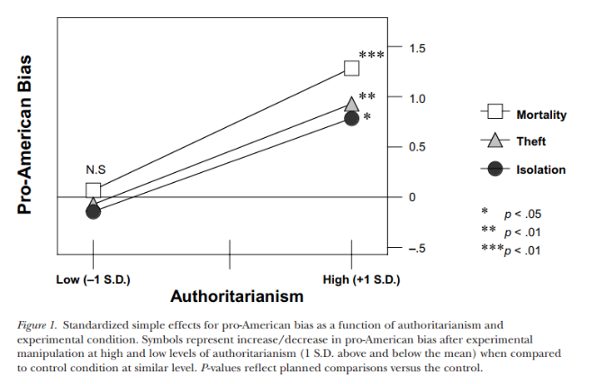
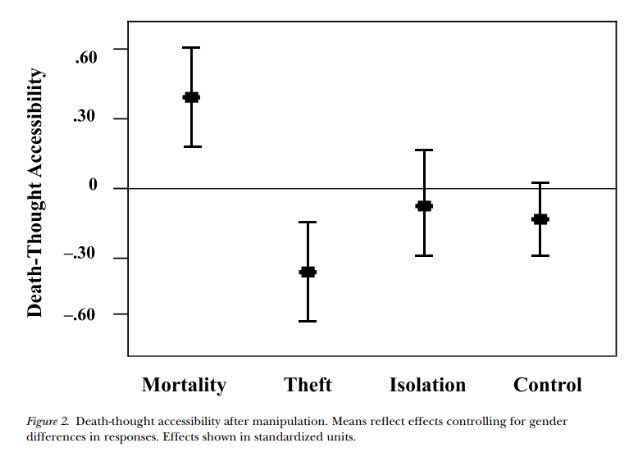
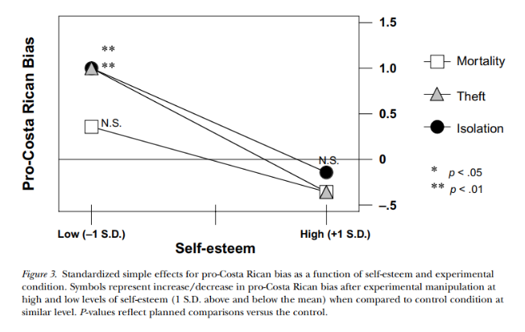
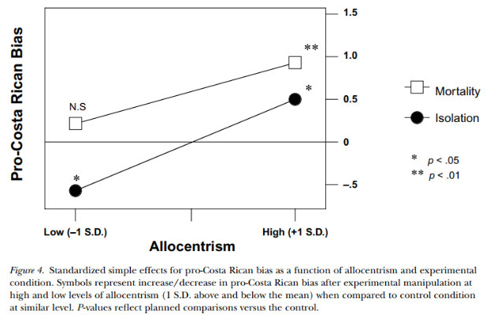

# Navarrete et al. (2004)まとめ

## Introduction

### TMTとは
TMTとは、
1. 人間の自己省察的思考は多様な環境で適応的だった
2. しかし、その思考ゆえに、自らの死を意識できた
3. その死への意識は、あらゆる努力が死によって無駄になることを想定させた
4. その不安は慢性的に生じるはずである
5. この不安を解消するために、ヒトは文化的世界観を構築した
6. そのため、文化的世界観が脅かされる（＝死の恐怖が顕現する）と、文化的世界観への信頼を強める
7. それによって、私たちは死への不安を低減しているのだ

とする理論のことである。この理論から導かれる仮説で代表的なものとして、文化的不安緩衝装置仮説(Cultural Anxiety Buffer Hypothesis; CAB仮説)と存在驚異顕現化仮説(Mortality Salience Hypothesis; MS仮説)がある。CAB仮説は「文化的世界観や自尊心が強いもの、また状態的に強化されている者は、死の予期から受ける驚異が小さい」(脇本, 2005)という仮説であり、MS仮説は「死の驚異が高まる(MS処理を受ける)と、文化的不安緩衝装置に対する欲求が高まる」(脇本, 2005)という仮説である。

### TMTの問題点
TMTは、２つの点で問題がある
1. 生存本能の仮定
2. 不安軽減の適応機能という考え

まず生存本能の仮定の問題点について述べる。TMTでは、人間の死を予期できる認知機能が不安をもたらし、結果的に文化的世界観を強めるとしている。しかし、生存本能はすべての生物が持っているとすると、このような現象が人間のみに備わっていると考えるのは非論理的である。例えば崖から落ちることを回避するのは、死を回避することと同義であるが、それは死の概念を用いなくても回避可能である。
次に、不安軽減の適応機能という考えの問題点について述べる。電車が近づいていることに不安を抱く人は、文化的世界観によって安心を得るかもしれないが、根本的な脅威はそのままである。そのため、死や危険に対するより適応的な反応は、不安の軽減ではなく、その出来事を低減する行動を起こすことであると考えられる。また、不安低減の機能が備わっていたとしても、「不安の過剰反応→過剰反応の調整」ではなく、過剰な反応の抑制を選択する理由は提供されていない。
以上の理由から、TMTには理論的問題点があると言える。

### TMTの代替理論
では文化的世界観を強める集団間バイアス（Mortality Salience Effect:MS効果）はなぜ生じるのだろうか。それは、社会的ネットワーク、対人愛着、および連合の形成を促進する適応的メカニズムのシステムによって説明できる。集団内の個人が適応するかどうかは、文化基準を内面化することが重要であると論じたHallowell (1963,1963）の考え方は、進化ゲーム理論モデルとも一致する。規範の内在化が規範遵守による社会的利得の上昇を招くためにあるのであれば（そしてその社会的利得が特に重要な状況では）、連合によって解決できる問題に直面したとき、連合の形成と維持を行うための規範支持を行うように人間の心は進化しただろう。多くの社会的認知研究によって、規範の内在化が重要であることは既に示されている(Aron, Aron, Tudor, & Nelson, 1991; Baldwin, 1992; Hardin & Higgins 1996; Leary, 2000; Schaller & Conway, 1999）。
ヒトが対人関係を構築・維持する重要な方法の一つは相互理解である。例えば、人が他者に自己呈示するときは、自分がよく見られるように呈示する（Asch, 1955; Baumeister & Leary, 1995; Schaller & Conway, 1999）。もし、人々が相手(集団)の魅力度によって話す内容を変えるなら（Hardin & Conley, 2001）、相手(集団)の評価も変わるだろう(Schaller & Conway, 1999）。社会的葛藤があるときに社会的関係が特に重要になることから（Baumeister & Leary, 1995; Tooby & Cosmides, 1996）、ヒトは特定の回避的刺激(具体的には所有物の窃盗、社会的孤立)にあうと、内集団への規範を肯定する態度が増加するはずである。この代替理論の確かさを検証するために、本研究では
- MS処理以外でもpro-ingroupな態度が増加すること
  - 所有物の盗難と社会的孤立の操作
- 採用したMS処理以外の処理(i.e. 盗難と孤立)は死の概念を顕現させないこと
  - 単語完成課題で測定
- MS効果は、特に自尊心が低い人、権威主義志向が高い人に顕著であること
- 上記の効果は、異なる文化圏でも観測されること
を検証する。(上記全てが支持された)

# S1:MSでなくとも集団間バイアスは増加

# S2:各処理は死を顕現させていない

# S3:S1の結果は異文化でも再現された

# S4:S1,3を再現＋MS効果はコスタリカで顕著

なお、UCLA学生では、社会的孤立＝盗難＜MSで集団間バイアス増加したが、コスタリカではMS＜社会的孤立で集団間バイアスが増加した。これは文化的差異を明確に説明している可能性。