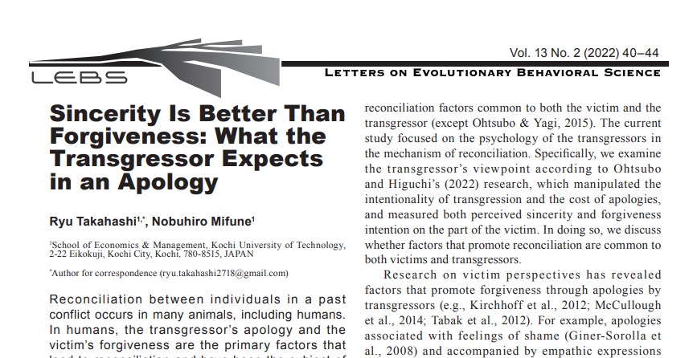
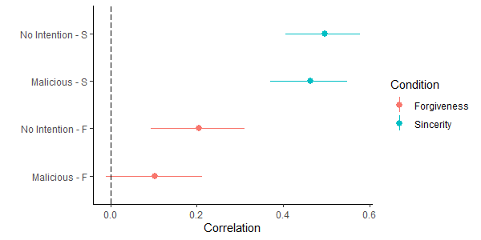
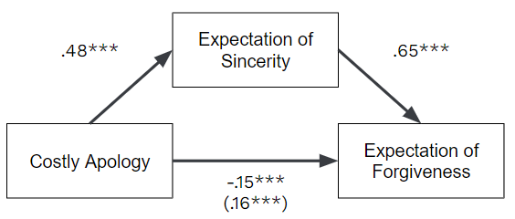

<!-- 
class: slides
headingDivider: 1
_paginate: false
 -->

# Sincere is Better   than Forgiveness
## What the transgressor expects in an apology  ※発表は日本語です
<!-- _class: title -->

# まとめ
<!-- class: slides -->
- (ヒトにおける)仲直り = 加害者の謝罪 + 被害者の赦し
  - これまでの研究では**被害者の赦し**に焦点
  - 謝罪と赦しの共通性に関してはほとんど研究されておらず
- 加害者はコストのかかる謝罪で何をどれくらい期待？
  - 謝罪コスト x 加害の意図性を操作し、赦しと誠意期待を測定
- 結果
  - 被害者の知覚を**正確に予測(期待)した**
  - 謝罪コストは、**誠意期待を媒介して赦し期待を増加**させる

# ちなみに…

# Introduction
<!-- _class: section -->

# 仲直りとは
<!-- class: slides -->
- 「過去に葛藤関係→個体間が仲直り→平和な関係を構築」現象は様々な動物で広く見られる 
  - e.g., de Waal, 2000; Cords & Thurnheer, 1993; Ikkatai et al., 2016
- 言語の発達したヒトにおいては、加害者による謝罪が被害者の赦しをもたらし、仲直りが成立することが多くの研究で示されてきた
  - e.g. Fehr, et al., 2010; Kirchhoff, et al., 2012; McCullough, et al, 2014; Tabak, et al., 2012; Schumann & Dragotta, 2021; Schumann, 2012

# 加害者視点の仲直り
- また、加害者側の謝罪に影響する要因についても多くの研究が行われている
  - e.g. Leunisssen et al., 2012; Ohtsubo et al., 2021; Okimoto et al., 2013; Wohl et al., 2013; Zaiser & Giner-Sorolla, 2013; Thai et al., 2021; Schumann & Dragotta, 2021; Exline et al., 2007; for review, Schumann, 2018
- 一方、被害者側の視点で赦しをもたらす要因を加害者側が重視するのかといった、被害者側と加害者側に共通した要因の検討はそれほど多くない (Ohtsubo & Yagi, 2015)

# 本研究の目的
- 本研究では、加害者側の謝罪の意図性とコストを操作し、被害者側の誠意の知覚や赦しの意図を測定したOhtsubo and Higuchi (2022) の研究に着目し、この研究を加害者視点で検討する。これにより、仲直りを促す要因が被害者側と加害者側で共通するのかを考察する。

# 被害者視点の、これまでの研究(1/2)
- 被害者視点の研究によって、加害者による謝罪と被害者の赦しを媒介する要因が明らかとなっている
  - e.g. Kirchhoff et al., 2012; McCullough et al, 2014; Tabak et al., 2012
- 例えば被害者側の赦しを促進する可能性が示されているものとして...
  - 謝罪に伴う恥感情 (Giner-Sorolla et al., 2008)
  - 被害者側への共感的な表現を伴う謝罪 (Nadler & Liviatan, 2006) 

# 被害者視点の、これまでの研究(2/2)
- Blatz and Philpot (2010)によるレビュー論文では、謝罪と赦しを媒介する要因としてRemorse, Empathsy, and Assinging responsibilityに加えて、Sincerityを挙げている。
- 本研究では仲直りにおける誠意の効果に着目する。

# 被害者視点での赦し、コストの観点から
- 被害者が知覚する誠意は加害者のコストのかかる謝罪によって促進される
  - e.g. Ohtsubo, et al., 2020a; Ohtsubo, et al., 2018; Ohtsubo, et al., 2012
- Ohtsubo and Watanabe (2009)はZahavi’s (1975) handicap principleを基にし、costly signaling model of apology を提唱し、その上で、コストのかかる謝罪が誠意の知覚を促すことを実験により示した。

# コストのかかる謝罪の効果
- コストのかかる謝罪の例として、例えば
  - 大事な予定をキャンセルして加害をした友人に謝罪をしに行く
  - お金を支払って謝罪する
  - etc.
- 上記のようなコストのかかる謝罪の方が、そうではない謝罪に比較して、誠意の知覚や赦しを高めた (Ohtsubo & Watanabe, 2009)。

# コストと意図性、赦しと誠意(1/2)
- 近年の研究によって、誠意の知覚や赦しに対して加害の意図性が謝罪のコストとは独立に効果を持つことが示されている。
- Ohtsubo and Watanabe (2009) のappendixにおいて、加害行為が意図的ではない場合は謝罪のコストの効果が見られない可能性が示されていた。
- この研究を基に、Ohtsubo and Higuchi (2022)は、意図性と謝罪のコストを操作し、赦しと誠意の知覚を測定した。

# コストと意図性、赦しと誠意(2/2)
- 誠意の知覚に対しては、意図性および謝罪コストのそれぞれの有意な主効果が見られたが、有意な交互作用効果は見られなかった。
  - 赦しにおいても同様の結   果が得られた。
- また、無意図条件、曖昧意図条件、意図条件のいずれにおいても、謝罪のコストが及ぼす誠意の知覚に対する効果量は、赦しに対する効果量よりも有意に大きかった。
- 加害の意図性と謝罪のコストはそれぞれ独立に誠意の知覚や赦しに影響を与えること、また、コストのかかる謝罪は赦しよりも誠意の知覚に対して大きな効果を持つことが示された。

# これまでの研究の問題点
- コストのかかる謝罪や意図のない加害行為は赦しを促し、仲直りに繋がる可能性が示されてきたが、これらの研究の多くが被害者視点でなされたものである (e.g., Ohtsubo & Watanabe, 2009)。
- では加害者も被害者と同様、コストのかかる謝罪は赦しではなく、誠意の知覚に効果的であると考えているのだろうか。
- 仲直りのプロセスを理解するためには、加害者視点において、謝罪のコストや意図性が相手の赦しに繋がると考えるかどうかを検討する必要があるだろう。
  - ↑本研究の検討事項

# 仮説
1. (a)赦し期待を従属変数とした場合、意図性および謝罪コストの有意な主効果が見られ、有意な交互作用は見られないだろう
1. (b)誠意期待を従属変数とした場合、意図性および謝罪コストの有意な主効果が見られ、有意な交互作用は見られないだろう
2. 意図なし条件および意図あり条件のどちらにおいても、謝罪のコストが及ぼす誠意の知覚の期待に対する効果量は、赦しの期待に対する効果量よりも有意に大きいだろう
3. 誠意の知覚の期待と赦しの期待には有意な正の相関があるだろう

# 3の理由(補足)
Ohtsubo and Higuchi (2022) や他の先行研究 (Wohl, et al., 2013; Schumann, 2012) では、被害者視点において、誠意の知覚と赦しに有意な正の相関が確認されている。
加害者視点においても、被害者が自身の誠意を知覚すると期待するならば、赦してくれるだろうという期待も高まると考えられるため。

# Method
<!-- _class: section -->

# Participants and Design
- 実験デザインは2（謝罪コスト：コストがかかる vs かからない）×2（意図性：意図あり vs 意図なし）
- Ohtsubo and Higuchi (2022)と同様に、シナリオの内容から参加者を20~40歳の就業者に限定
- Lancers (https://www.lancers.jp/) を用い、各条件100人ずつとなるように1件あたり150円を支払ってリクルート
  - 結果、603人（女性258人、男性341人、わからない or それ以外4人、平均年齢±SD=33.55±5.15歳）が分析対象に

# Procedure
参加者はQualtrics (https://www.qualtrics.com)で作成されたWeb上のアンケートに回答した。
- 参加者はまず、自身の年齢と雇用形態を回答した。
- このとき、20歳から40歳までの被雇用者という参加基準を満たさない者はその後に進むことができなかった。
- 基準を満たした参加者はOhtsubo and Higuchi (2022)で用いられた仮想的な違反シナリオを、加害者側の視点に変更したシナリオを読んだ。

# Procedure
- シナリオは4種類あり、全てのシナリオに対して悪意の意図がある加害か無い加害か、コストをかけた謝罪をしたかコストをかけない謝罪をしたかで4バージョン（条件）が設定された。
- シナリオは二部に分かれており、第一部では主人公が被害者に加害する場面が記述され、第二部では主人公が被害者に謝罪する場面が記述されていた。

# シナリオの例(第一部)
- あるシナリオの第一部では主人公（P）が友人（F）の仕事中に連続したテキストメッセージを送信した場面が描かれた。
  - 意図**なし**条件：PはFが勤務中であることを**知らなかった**
  - 意図**あり**条件：PはFが勤務中であることを**知っていた**
- 第一部の直後、参加者は主人公の立場から、友人は主人公に対してどのくらい怒りを感じると思うか、どの程度友人関係を解消する可能性があると思うかを回答した。
  - なお、この質問項目はOhtsubo and Higuchi (2022) と同様、分析には用いなかった。

# シナリオの例(第二部)
- シナリオの第2部では、主人公Pの謝罪としてコストのかかる謝罪とコストのかからない謝罪のどちらかが記述されていた。
  - コストの**かかる**謝罪条件:PはFの家に**2時間以上かけて**行って謝罪した
  - コストの**かからな**い謝罪条件:PはFに**次に会ったときに**謝罪した
- 第二部を読んだ後に参加者は、誠意期待と（Cronbachのα=0.86）、（5項目×4シナリオ、α=0.92）について、4つのシナリオごとに回答

# その他、補足
- 誠意知覚と赦し知覚の合計8項目は参加者毎にランダムに配置された。
- なお、Ohtsubo and Higuchi (2022) では搾取リスク知覚とFとの関係評価も測定されていたが、本研究の仮説検証には不必要だと判断し、除外した。
- 参加者がすべてのシナリオと評価に回答した後、最後に参加者は性別と政治的立場について回答し、アンケートを終了した。
- 回答にかかった時間はおおよそ8分であった。

# Results
<!-- _class: section -->

# 仮説1-a,1-bともに支持
 

  # 仮説2を支持

  # 仮説3を支持

# (参考)以下の結果は、すべて支持された
1. (a)赦し期待を従属変数とした場合、意図性および謝罪コストの有意な主効果が見られ、有意な交互作用は見られないだろう
1. (b)誠意期待を従属変数とした場合、意図性および謝罪コストの有意な主効果が見られ、有意な交互作用は見られないだろう
2. 意図なし条件および意図あり条件のどちらにおいても、謝罪のコストが及ぼす誠意の知覚の期待に対する効果量は、赦しの期待に対する効果量よりも有意に大きいだろう
3. 誠意の知覚の期待と赦しの期待には有意な正の相関があるだろう

# Discussion
<!-- _class: section -->

# 仮説1a, 1b, 2について
- これらは、同様の効果を被害者視点で測定したOhtsubo & Higuchi (2022)の結果と一貫している。
  - すなわち、意図のある加害をした場合に特にコストをかけた謝罪が有効であると加害者側の被験者は考えなかった。
- したがって、被害者側が加害の意図がない場合や謝罪のコストがある場合に仲直りを促進するだけでなく、加害者側もそれらの効果を適切に予測できる可能性が示された。
- 本研究結果は、意図性や謝罪コストが被害者-加害者間で共通して仲直りのプロセスを促進する可能性を示している。

# なぜ、交互作用は有意でないか？
- 先行研究では…
  - 意図のある加害よりも意図の無い加害に対して罪悪感を強く感じ、謝罪が必要だと考えたり (Leunissen et al., 2013)
  - 意図の無い加害における罪悪感が高いほど謝罪に大きなコストをかけることが示されている (Watanabe & Ohtsubo, 2012)。

# なぜ、交互作用は有意でないか？
- コストのかかる謝罪が有効であるという認識に対しても、意図のない加害では罪悪感が働き、意図のある加害では別の要因が働く？。
- あるいは、本研究のように謝罪による被害者心理の推測と、謝罪行動や謝罪意図では異なる心理要因が働く？。
  - 謝罪行動や謝罪意図を測定していないという点は本研究の限界のひとつ
  - 今後、謝罪行動や謝罪意図を測定した実験により、意図性の有無と謝罪のコストの関係を検討する必要がある。

# 仮説3について
探索的な分析の結果、謝罪コストは誠意知覚を媒介して赦し期待に効果を持つことが示された。
- これまでにも被害者視点において、謝罪コストが誠意知覚や赦しに対して効果を持つこと (e.g., Ohtsubo et al., 2012)。
- また、Ohtsubo and Higuchi (2022) においても謝罪コストは赦しよりも誠意知覚に対して大きな効果量を持つことが示されている。

# 仮説3について
これらは、謝罪コストにおける誠意のシグナルとしての働きを重視する、costly signaling model of apologyと一貫する
今後、謝罪行動や謝罪意図に対しても誠意のシグナルが効果を持つかを検討する必要があるだろう (cf., Watanabe & Ohtsubo, 2012)。

# References
<!-- _class: section -->

# 1/2
<!-- class: ref -->
- Blatz, C. W., & Philpot, C. (2010). On the outcomes of intergroup apologies: A review. Social and Personality Psychology Compass, 4(11), 995–1007. https://doi.org/10.1111/j.1751-9004.2010.00318.x
- Cords, M., & Thurnheer, S. (1993). Reconciling with valuable partners by long-tailed macaques. Ethology, 93(4), 315–325. https://doi.org/10.1111/j.1439-0310.1993.tb01212.x
- De Waal, F. B. (2000). Primates--a natural heritage of conflict resolution. Science, 289(5479), 586–590. https://doi.org/10.1126/science.289.5479.586
- Fehr, R., Gelfand, M. J., & Nag, M. (2010). The road to forgiveness: a meta-analytic synthesis of its situational and dispositional correlates. Psychological Bulletin, 136(5), 894–914. https://doi.org/10.1037/a0019993
- Giner-Sorolla, R., Castano, E., Espinosa, P., & Brown, R. (2008). Shame expressions reduce the recipient’s insult from outgroup reparations. Journal of Experimental Social Psychology, 44(3), 519–526. https://doi.org/10.1016/j.jesp.2007.08.003
- Ikkatai, Y., Watanabe, S., & Izawa, E. I. (2016). Reconciliation and third-party affiliation in pair-bond budgerigars (Melopsittacus undulatus). Behaviour, 153(9-11), 1173–1193. https://doi.org/10.1163/1568539X-00003388
- Kirchhoff, J., Wagner, U., & Strack, M. (2012). Apologies: Words of magic? The role of verbal components, anger reduction, and offence severity. Peace and Conflict: Journal of Peace Psychology, 18(2), 109–130. https://doi.org/10.1037/a0028092
- Leunissen, J. M., De Cremer, D., & Folmer, C. P. R. (2012). An instrumental perspective on apologizing in bargaining: The importance of forgiveness to apologize. Journal of Economic Psychology, 33(1), 215–222. https://doi.org/10.1016/j.joep.2011.10.004
- McCullough, M. E., Pedersen, E. J., Tabak, B. A., & Carter, E. C. (2014). Conciliatory gestures promote forgiveness and reduce anger in humans. Proceedings of the National Academy of Sciences of the United States of America, 111(30), 11211–11216. https://doi.org/10.1073/pnas.1405072111
- Nadler, A., & Liviatan, I. (2006). Intergroup reconciliation: Effects of adversary's expressions of empathy, responsibility, and recipients' trust. Personality and Social Psychology Bulletin, 32(4), 459–470. https://doi.org/10.1177/0146167205276431
- Ohtsubo, T, & Higuchi. M. (in press). Apology Cost Is More Strongly Associated with Perceived Sincerity than Forgiveness. Letters on Evolutionary Behavioral Science. 

# 2/2
- Ohtsubo, Y., Matsunaga, M., Himichi, T., Suzuki, K., Shibata, E., Hori, R., ... & Ohira, H. (2020). Costly group apology communicates a group’s sincere “intention.” Social Neuroscience, 15(2), 244–254. https://doi.org/10.1080/17470919.2019.1697745
- Ohtsubo, Y., Matsunaga, M., Tanaka, H., Suzuki, K., Kobayashi, F., Shibata, E., ... & Ohira, H. (2018). Costly apologies communicate conciliatory intention: An fMRI study on forgiveness in response to costly apologies. Evolution and Human Behavior, 39(2), 249–256. https://doi.org/10.1016/j.evolhumbehav.2018.01.004
- Ohtsubo, Y., & Watanabe, E. (2009). Do sincere apologies need to be costly? Test of a costly signaling model of apology. Evolution and Human Behavior, 30(2), 114–123. https://doi.org/10.1016/j.evolhumbehav.2008.09.004
- Ohtsubo, Y., Watanabe, E., Kim, J., Kulas, J. T., Muluk, H., Nazar, G., ... & Zhang, J. (2012). Are costly apologies universally perceived as being sincere? A test of the costly apology-perceived sincerity relationship in seven countries. Journal of Evolutionary Psychology, 10(4), 187–204. https://doi.org/10.1556/JEP.10.2012.4.3
- Ohtsubo, Y., & Yagi, A. (2015). Relationship value promotes costly apology-making: Testing the valuable relationships hypothesis from the transgressor's perspective. Evolution and Human Behavior, 36(3), 232–239. https://doi.org/10.1016/j.evolhumbehav.2014.11.008
- Schumann, K. (2012). Does love mean never having to say you’re sorry? Associations between relationship satisfaction, perceived apology sincerity, and forgiveness. Journal of Social and Personal Relationships, 29(7), 997-1010. http://dx.doi.org/10.1177/0265407512448277
- Schumann, K. (2018). The psychology of offering an apology: Understanding the barriers to apologizing and how to overcome them. Current Directions in Psychological Science, 27(2), 74–78. https://doi.org/10.1177/0963721417741709
- Schumann, K., & Dragotta, A. (2021). Empathy as a predictor of high-quality interpersonal apologies. European Journal of Social Psychology. 51(6), 896–909. https://doi.org/10.1002/ejsp.2786
- Tabak, B. A., McCullough, M. E., Luna, L. R., Bono, G., & Berry, J. W. (2012). Conciliatory gestures facilitate forgiveness and feelings of friendship by making transgressors appear more agreeable. Journal of Personality, 80(2), 503–536. https://doi.org/10.1111/j.1467-6494.2011.00728.x
- Watanabe, E., & Ohtsubo, Y. (2012). Costly apology and self-punishment after an unintentional transgression. Journal of Evolutionary Psychology, 10(3), 87–105. https://doi.org/10.1556/JEP.10.2012.3.1
- Zahavi, A. (1975). Mate selection—a selection for a handicap. Journal of Theoretical Biology, 53(1), 205–214. https://doi.org/10.1016/0022-5193(75)90111-3

# まとめ(再掲)
<!-- _class: slides -->
- (ヒトにおける)仲直り = 加害者の謝罪 + 被害者の赦し
  - これまでの研究では**被害者の赦し**に焦点
  - 謝罪と赦しの共通性に関してはほとんど研究されておらず
- 加害者はコストのかかる謝罪で何をどれくらい期待？
  - 謝罪コスト x 加害の意図性を操作し、赦しと誠意期待を測定
- 結果
  - 被害者の知覚を**正確に予測(期待)した**
  - 謝罪コストは、**誠意期待を媒介して赦し期待を増加**させる

<!-- 以下、CSSコード -->

