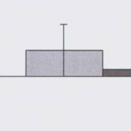

# 竹澤先生の論文より

- 自由選択パラダイム
  1. アイテムを複数提示される
  2. リッカート尺度で好意度を評価
  3. アイテムのうち、同じ評価の２つを提示
     - ２つのうち、一つを持ち帰っていいと自由に選択させる
  4.  もう一度、すべてのアイテムについて好意度を評価

→ 1と4では評価が変わり、3で選んだものの評価が高くなる

上記のパラダイムをモデル化すると$$u_i$と書ける。ただし、
- $i$：あるアイテムのこと
- $u_i$：あるアイテム $i$ に対する選好のこと

である。
竹澤先生は、この自由選択パラダイムをモデル化することで1と4で評価が変わることが、認知的不協和理論を用いなくても生じうるとしている。
例えば、本人の選好がアイテム1と2で全く同一であるとする。しかし、２つの選好が全く同一だったとしても、リッカート尺度で同様の評価がされるとは限らない。なぜなら、人間の行動には小さな確率でエラーが生じるからである（経済学では、このようなエラーをランダム効用モデルとして前提においている、らしい）。故に、一度目で$u_1=u_2$であり、二度目で$u_1>u_2$と評価されたとしても、それは認知的不協和ではなく、行動のエラーによって生じた可能性を否定できない。故に、（ただ単に）自由選択パラダイムによって検証するだけでは認知的不協和理論が支持されたとはいえない。

ちなみに、対応バイアスだと…
観察者は「特性$d$は人間という母集団においてどのように分布しているか」に付いての信念である事前分布を$P(d)$とする。観察者の状況に対する知覚$s$と行為社の行動$a=1$としたとき、観察者の事後信念(確率)、すなわち$P(d|s, a=1)$を推定する。このとき、観察者をベイジアン合理的な個人とすると、２つのパラメータを適当に設定することでJones and Haris (1967)の結果が再現されるという。
- $d$：個人がもつ特性
    - 自由に行動を選択できる場合…
        - 0より大きいほど行動選択の確率は1へ
        - 0の場合、行動選択の確率は 0.5
        - 0より小さいほど行動選択の確率は0へ
- $s$：（個人に行動を強制する）外的要因の強さ
  - 0ならば外的圧力が何もない
  - 0より大きいほど行動を選択する確率は1へ
- $P(d)$：「特性$d$は人間という母集団においてどのように分布しているか」についての信念である事前分布

## Izuma & Murayama 2013
自由選択パラダイムは、やばい。

# パラダイムと、実際の実験手順

- Blind Choice Paradigm
- Rate-Rate-Choice Paradigm
- Implicit Choice Paradigm

# Izuma et al. 2010の手順
本実験は、（i）選好課題1、（ii）選択課題、（iii）選好課題2、（iv）実験後選択課題の4つのパートから構成された。実験後選択課題を除き、すべての課題はfMRIスキャナ内で行われた（実験課題および手順の詳細についてはSI Methodsを参照）。
選好課題1（Fig.1A）では、被験者は画面上に提示された食品に対する好みを8段階（1＝全く好きでない、8＝とても好き）で評価するよう指示された。選択課題では、自己試行とコンピュータ試行の2種類の試行が行われた(Fig. 1B)。自己試行では(Fig. 1B、上)、2つの食品が同時に画面上に提示され、被験者は好きな食品を1つ選ぶよう指示された。被験者には知らされていなかったが、Matlabのプログラムによって、Self試行の約半分は、2つの好みの食品（すなわち、嗜好性評価が5以上）が含まれ、Preference task 1で同様の評価（すなわち、嗜好性評価の差が0か1）であった（これらは、Self-Difficult試行であった）。残りの半分の自己試行では、1つの好ましい食品と1つの好ましくない食品（すなわち、嗜好性評価が4以下）が含まれ、2つの食品は少なくとも3ポイントの評価の違いがあった（これらは自己-容易試行であった）。コンピュータ試行(Fig. 1B、下)では、コンピュータがランダムに選んだ食品(赤い四角で表示)に対応するボタンを押すように被験者に指示した。コンピュータ試行では、自己困難試行と同様に、コンピュータ試行には必ず同じように好みの食べ物が2つ含まれるように、食べ物のペアが決定された。各食品は1組ずつしか登場しない。
嗜好課題2では、同じ160個の食品が画面に提示され、被験者は再び各食品に対する嗜好を評価するよう求められた。しかし、重要な違いの1つは、選択課題で提示されたペアに含まれる食品について、選択課題中の被験者（またはコンピュータ）の過去の判断（例えば、「あなたはそれを選んだ」、「あなたはそれを拒否した」、「コンピュータはそれを選んだ」、「コンピュータはそれを拒否した」）がそれぞれの食品の下に提示されていることである（Fig.1C）。選択課題では用いなかった食品刺激については、選好課題1と同様に食品の写真のみを画面上に提示した。
Preference課題2の後、被験者はfMRIスキャナの外でPost Ex-Choice課題を実施した。被験者は、Choice課題のComputer試行で登場した食品と同じ組の中から好きなものを選ぶように指示された。最後に、被験者は160の食品について、それぞれ8点満点で親しみを評価した。

Izuma et al. (2010)は、参加者に対して160個の食品(e.g., チップスター、オレオ)に対する好みを8段階（1＝全く好きでない、8＝とても好き）で評価させた(first rating task)後に、160の食品から2つの食品を提示させ、どちらが好ましいかを回答させた(choice task)。なお、choice taskの際、被験者内でコンピューター条件(赤枠で囲まれた方を選択してください)と自己選択条件(自分の好みの方を選択してください)の2つの条件が設定された。choice taskの後、被験者は160の食品がその食品の評価(コンピュータが選んだ or 拒否した、もしくはあなたが選んだ or 拒否した)と一緒に提示され、その食品について評価を行った(second rating task)。その結果、被験者の線条体(報酬が与えられたときに賦活する部位。機能的特異性も一貫性も高い)の活動は選好評定値の差が0もしくは1の食品に対して自分が拒否したとき、抑制された（下図参照）。

## Sharot et al., 2010の、Blind Choice Paradigmの手順
参加者 21 名（男性 9 名、女性 12 名、年齢層 18-31 歳）のデータが解析に含まれた。無反応試行回数が25％を超えたため、さらに2名の参加者を除外した。このレベルの成績は、以前に利用された先行カットオフである (Sharot, De Martino & Dolan, 2009; Sharot, Shiner, Brown, Fan & Dolan, 2009)。2名の参加者は誤ったボタンキーの使用により、また1名はコンピュータのエラーにより、それぞれ除外された。参加者全員がインフォームドコンセントを行い、参加費を支払った。
**刺激** 刺激は、以前の研究(Sharot, De Martino & Dolan., 2009)から転用した80の休暇先名から構成された。刺激の提示順はランダムであった。
**手順** 選択前評価課題は、11秒間の80回の試行からなる。各試行では、休暇先の名称が6秒間画面に表示された。参加者は、来年の休暇をその場所で過ごすことを想像するように指示された。参加者は2秒間で、その場所で休暇を過ごすとしたらどの程度幸せか（1-不幸、2-少し不幸、3-中立、4-幸せ、5-非常に幸せ、6-非常に幸せ）をキーボードで評価した。参加者が回答しない場合、その試行は最終的なデータ分析から除外された。その後、3秒間、固定十字を呈示した。
**選択課題**　ペアは、セッション1で同じ評価を受けた2つの選択肢が試行の約75%に含まれ（臨界条件）、残り（試行の約25%）はセッション1で異なる評価を受けた2つの選択肢が含まれるように、以前実施したMatlabプログラムによって決定した（Sharot et al.、2009）。これは、ここにデータと分析を報告する重要試行における差の検出力を高めるために実施されたものである。各刺激は1組のみ出現した。すべての選択肢は仮定のものであった。
参加者は、この研究は「サブリミナル的意思決定」を調べるためのものであることを説明された。参加者にそう信じてもらうために、この研究室で行われた同様の研究を説明した論文「Subliminal instrumental conditioning demonstrated in the human brain」を見せた（Pessiglione et al, 2008）。被験者は、今回の実験がフォローアップ研究であることを告げられた。参加者は、各試行で、セッション1でマスクされた2つの休暇先の名前が画面上に2ミリ秒間並んで表示されることを告げられた。参加者は、これらの刺激はごく短時間に出現し、かつマスクされているため、意識的に知覚することはできないと告げられた。実際には、この2秒間にナンセンスな走り書きだけが提示された（以下のようなもの）。「というような無意味な走り書きが表示されるだけで、休暇先が表示されることはなかった。次に「選択」という言葉が画面に現れ、参加者は「マスクされた」休暇先（右のものと左のもの）のどちらで休暇を過ごしたいか、2つのボタンのいずれかを押して指示した（ここでも-実際にはマスクされた刺激は提示されていない）。参加者は2秒以内に回答し、決定が下されると「選ばれた」目的地と「拒否された」目的地の名前が画面に表示され（例：ギリシャ - タイ）、参加者が盲目的に選んだ目的地の上に星が表示されました。試行は4秒間続いた。その後、3秒間、固定十字が呈示された。
選択後の評定は、選択前の評定課題と同じであった。
分析。分析は、以前行ったように行った(Sharot, De Martino & Dolan, 2009; Sharot, Shiner, Brown, Fan & Dolan, 2009)。各参加者と刺激について、平均補正後選択前評価から平均補正後評価（すなわち、差分得点）を引くことによって、選択後の嗜好のシフトを算出した。そして、各参加者について、選択刺激と拒否刺激について平均差スコアを算出した。これらが0と有意に異なるか、また互いに有意に異なるかを調べるためにt検定を実施した。平均補正評価は、特定の刺激の評価の、その参加者とセッションの平均評価からの距離（xi - μ）であり、そのセッションの他のすべての刺激に対する刺激の相対的な価値を示す。

例えば…
Blind Choice Paradigmを実施した研究として、Sharot et al. (2010)がある。Sharot et al. (2010)では、80の休暇先(e.g., )を刺激として用いている。実験手順としてはまず、選択前評価課題(first rating task)が行われた。このセクションでは最初に休暇先の名称が6秒間画面に表示された。参加者はその間、「来年の休暇をその場で過ごすことを想像するよう」指示された。その後、2秒間でどの程度幸せか(1-不幸、2-少し不幸、3-中立、4-幸せ、5-非常に幸せ、6-非常に幸せ)を回答させ、残りの三秒間は固定十字を提示した。この1回あたり11秒間の試行を80回行うことで選択前評価課題を終えた。次にサブリミナル意思決定課題(Blind choice task)が行われた。この課題ではまず、無意味な文字列(e.g., “%^!x *&()%)を2msだけ、画面の右と左に提示する。その後、2つの休暇先についての文字が提示され、「どちらの休暇先(右の休暇先か、左の休暇先か)が良いか」を選択させた。ただし、ここでも旅行先についての文字列は提示していない。被験者が選択したあと、ランダムに休暇先の組を提示して(e.g., ギリシャ - タイ)、被験者が押した方向の休暇先に星マークをつけた。最後に、選択後評価(second rating task)を選択前評価と同様に実施した。その結果、被験者は盲目的（i.e., 選好を反映していない）にもかかわらず、選択した方の選好がfirst rating taskよりも高くなったが、拒否した休暇先についてはfirst rating taskと変わらなかった。

まとめると…

- 自由選択パラダイムと同様に、first rating taskを実施する
- choice taskにて、選択者のもとの選好を反映せず選択させる
  - Sharot et al. (2010)では、意味のない文字列のどちらが良いか選ばせる
- その後、自由選択パラダイムと同様にsecond rating taskを実施する

以上の手順を行うメリットは、「**選択**による選好の変化」だけを測定している点である。竹澤 (2018)が指摘しているように、自由選択パラダイムの問題の一つは、first rating taskにおけるアイテムへの評価は真の選好を反映しているという、現実的でない仮定をおいていることである。そのため、自由選択パラダイムによる評価の変化は、「choice taskは元々の選好の差を明確にしただけである」という反論には適切な回答を出せない。一方で、Blind Choice Paradigmは、真の選好を無意味なものにする、あるいは選んだ対象をわからなくする(Egan et al., 2007)ことで「choice taskは、元々の選好に関係なく、選択の効果のみを反映できる」ことが手順上のメリットとなる。一方で、このパラダイムではそもそも真の選好を正確に測れていない可能性が指摘されているため(Risen & Chen, 2010)、完全な手法とは言えない。