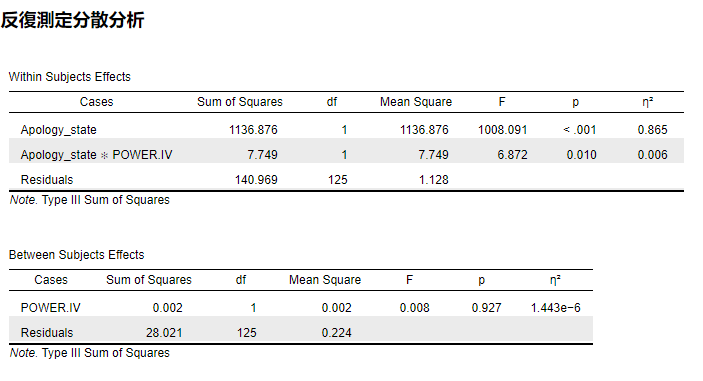
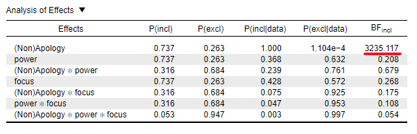

<thetitle>Powerと謝罪意思の関係性</thetitle>
 
<subtitle>Power Approach理論からみた、謝罪意思を阻害する要因と理由</subtitle>

**目次**

- [Power による BIS が、謝罪を阻害する](#power-による-bis-が謝罪を阻害する)
  - [Power Approach Theoryとは？](#power-approach-theoryとは)
  - [Behavioral Approach/Inhabbit Systemとは？](#behavioral-approachinhabbit-systemとは)
  - [謝罪とPowerの関係とは？](#謝罪とpowerの関係とは)
  - [方法](#方法)
- [実験の結果](#実験の結果)
  - [S2:high-powerの人は、非謝罪（？）](#s2high-powerの人は非謝罪)
  - [S3:trait social powerのNonapologyは、self-focusに媒介されている（？）](#s3trait-social-powerのnonapologyはself-focusに媒介されている)
  - [S3:trait social powerのApologyは、self-focusにもother-focusにも媒介されている（？）](#s3trait-social-powerのapologyはself-focusにもother-focusにも媒介されている)
  - [S4:self-focusをともなうsocial powerは非謝罪と関連し、other-focusをともなうsocial powerは謝罪と関連する(p.11)（✕）](#s4self-focusをともなうsocial-powerは非謝罪と関連しother-focusをともなうsocial-powerは謝罪と関連するp11)
- [この結果が怪しい点](#この結果が怪しい点)
  - [S2は問題なさそう](#s2は問題なさそう)
  - [ベイズでも良い証拠が出ている](#ベイズでも良い証拠が出ている)
- [しかし…S4は大問題](#しかしs4は大問題)
  - [帰無仮説有意性検定(NHST)でもすべて有意差でない(分散分析)](#帰無仮説有意性検定nhstでもすべて有意差でない分散分析)
- [なぜこのような結果になったか？](#なぜこのような結果になったか)
  - [HARKingの可能性](#harkingの可能性)
  - [ロジックの甘さ](#ロジックの甘さ)
  - [理論の妥当性が低い](#理論の妥当性が低い)
- [高橋の感想](#高橋の感想)
  - [良い論文は、まとめやすい](#良い論文はまとめやすい)
  - [理論を拡張する論文の書き方の勉強になった](#理論を拡張する論文の書き方の勉強になった)
  - [統計的手法への理解が重要であると実感](#統計的手法への理解が重要であると実感)
  - [謝罪はやっぱり面白い](#謝罪はやっぱり面白い)

<!-- Introduction -->

# Power による BIS が、謝罪を阻害する

## Power Approach Theoryとは？
Power Approach Theoryとは、Keltner et al. (2003)によって提唱されたパワーに関する理論である。powerとは、資源分配の権利を持つことであり、集団内の地位が高いというstatusとは区別される(Fiske, 1993)。Power Approach Theoryによれば、以下の図にあるように、高い権力を持った人は接近動機が活性化しやすく、低い権力を持った人は回避動機を活性化しやすいという。今回紹介する論文Guilfoyle, et al., (2022)は、このPower Approach Theoryと(後述する)BIS/BASのロジックを用いて

- (1)Powerの高さは、非謝罪意思を高め、謝罪意思を低くする。
- (2)Powerによって非謝罪意思が高まるのは、self-focusを媒介しているからである。
- (3)Powerが高い人物でも、other-focus(i.e. 視点取得)を促すことで謝罪意思は高まる。

の3つの仮説を検証する論文である。以下ではPower Approach Theoryを支持する実証研究を紹介した後、BAS/BISについて概説し、本論文のロジックを提示したあと、方法と結果を紹介する。なお、本論文の分析方法は妥当な方法であると言えない部分が目立つため、髙橋が再度分析した結果も後に載せている。
Power Approach Theoryを支持する研究としてはたとえば、被害者の権力(power)が強いほうが赦しやすく恨みにくいが、復讐しやすく(Struthers et al., 2019)、被害者の権力(power)と性別には、交互作用効果がある(男性は地位が低いと助けてほしいという行動をするが、女性は低いほうがその行動をする)(Gonzales, 1990)ことが示されている。さらに、powerと共感との関連性を示す研究もいくつかあり、たとえば、自己中心的な性質を持つ人(SVO,感謝、関係的自己構造で判定)は、権力(power)が高まると視点取得能力が低くなること(Gordon & Chen, 2013)、高い権力(power)を持つように操作された被験者は、視点取得が阻害されること(powerと視点取得には負の相関)(Galinsky et al., 2006)が示されている。これらの研究結果を拠り所に、Guilfoyle, et al., (2022)は、「Powerの高い被験者はBISをアクティベートする」と述べている。では、BIS、そしてその対照的システムであるBASとは何なのだろうか？

## Behavioral Approach/Inhabbit Systemとは？
Behavioral Approach System(BAS)とは、食べ物や達成、安全といったものを制御するシステムのことであり、Behavioral Inhabbit System(BIS)とは、脅威、罰、不確実性に対して活性化する警告システムのことである。BISは他者思考を促し、BASは自己中心的思考を促す※(FIske, 1993)。以前紹介した病原菌脅威に関する論文(Makhanova et al., in press)はBISによって集団の同質性が高まるかどうかを検討した論文である。

※実際に測定されたかは示されていない。

## 謝罪とPowerの関係とは？
これまで見てきたことをまとめると、

- Power Approach Theoryによると、high-powerの人は接近動機、low-powerの人は回避動機が活性化される
- 人は脅威から遠ざかるようなシステム(i.e. BIS)を持っている

ことが示されている。これまでもPowerやBISと和解の関係を検討した研究は存在する。たとえば、BISに関しては社会的排斥を操作された参加者は被害者への危害を最小限に見積もり、恥や後悔、自己嫌悪が少なく、被害者との和解を望むことも少なかったこと(Woodyatt & Wenzel, 2013)や、被害者の権力(power)が強いほうが赦しやすく恨みにくいが、復讐しやすいこと(Struthers et al., 2019)が示されている。
しかし、これまでのpowerと和解に関する研究は、多くが被害者と赦しでの研究であり、powerと謝罪の関係に関して直接的に検討した研究はない。もし、Power Approach Theoryが予測するように、Powerが高い加害者は、低い加害者に比べて(BISによって)self-focusをする傾向にあるはずである。さらに、self-focusをする加害者のpowerが高まると視点取得が低くなること(Galinsky et al., 2006; Gordon & Chen, 2013)から、非謝罪傾向が高くなるはずである。よって、この研究で確認する仮説は、以下の2つである。

- (1)Powerの高さは、非謝罪意思を高め、謝罪意思を低くする。
- (2)Powerによって非謝罪意思が高まるのは、self-focusを媒介しているからである。
- (3)Powerが高い人物でも、other-focus(i.e. 視点取得)を促すことで謝罪意思は高まる。

## 方法
- Study 1 & 3
  - スノーボールサンプリングで操作せず調査
    - 大学生に、知り合いに調査してもらう
    - 調査対象は重複しないように注意
  - Study 1：社会的パワーと謝罪の特性、状態を検討
  - Study 3：上記に追加で、focus(self vs. other)の特性を検討
- Study 2
  - 社会的パワーを実験的に操作
    - あなたは評価されるなど vs. 評価する側など
  - (過去の加害に対する)謝罪状態を回答させる
    - 非謝罪と謝罪、PAMを測定
- Study 4
  - 加害を思い出させる 
  - 社会的パワーと焦点を操作
    - 社会的パワーはS2と同様
    - 焦点の操作
      - その加害を他の人から見てどう思うか？
      - その加害を自分から見てどうか？
    - いずれの操作にも成功している
  - PAM、非謝罪と謝罪、加害の深刻さを回答させる

# 実験の結果

## S2:high-powerの人は、非謝罪（？）

## S3:trait social powerのNonapologyは、self-focusに媒介されている（？）

## S3:trait social powerのApologyは、self-focusにもother-focusにも媒介されている（？）

## S4:self-focusをともなうsocial powerは非謝罪と関連し、other-focusをともなうsocial powerは謝罪と関連する(p.11)（✕）

# この結果が怪しい点
- 検定の多重性をガン無視している
  - t検定を平気で繰り返している(S1,S4)
  - 分散分析の使い方がおかしい(S2,S4)
- 解釈がおかしい
  - CIが0をまたいでいるのに、有意(S3)
  - main effectではなく、t検定で比較(S4)
  - 平均値が違うからとか言ってしまってる(S2)

なので、本当か検証してみる。※S1,S3は今回の検証対象外

## S2は問題なさそう

## ベイズでも良い証拠が出ている

# しかし…S4は大問題

モデルとしては、Apology or NonApologyのみを含めるのが最も良いモデル

ベイズファクターでも、測定間の差しかでていない(むしろ入れないほうが良い変数が多い)

## 帰無仮説有意性検定(NHST)でもすべて有意差でない(分散分析)
Guilfoyle, et al., (2022)のやり方ですら、主張を支持しない。

正しい分析(下図)をすると、より怪しい。この分析ではPAMによってApologyとNonapologyへの影響を条件間(共分散として扱うこと)で統制し、反復測定分散分析を行うことで多重比較が生じないようにし、それぞれにpowerとfocusの条件を被験者間として扱うことで、本来の効果量を推定できるようにしている。

# なぜこのような結果になったか？
未熟な私が査読付き論文に対して指摘を行うのは大変に恐れ多いことではあるが、学習のため、以下では結果についての記述と分析結果が一致しないor妥当ではない理由を考察する。

## HARKingの可能性
本文中で言及されている分析と、再分析の結果が一致しない理由としては、HARKingの可能性が最も大きい。本文中ではsimple effect testとして、各条件間のmain effectではなく、各条件ごとにt検定を実施している。さらに多重比較についても言及されていない(なおかつ、反復測定分散分析をしないことで、Apology - Nonapology間でも有意差が出しやすくなるようにしている)ため、有意差が出るように分析を恣意的にしている可能性がある。

## ロジックの甘さ
理論と仮説までのロジックが不十分であることも、本論文の主張に疑問を投げかける。たとえば、著者はpowerがBISを活性化させると主張しているが、power approach theoryによれば、powerの上昇は接近動機を高めるため、BISではなく、BASを活性化させるはずである。なぜBASではなくBISを活性化させると考えるのかについては本文中では言及されていないため、主張のロジックが弱いと言わざるを得ない。確かにFiske (1995)ではpowerによってself-focusになる傾向にあるはずだと書かれているが、その主張を支える実証的研究は示されておらず、いずれにせよ本論文の主張は曖昧なものであると言わざるを得ない。

## 理論の妥当性が低い
さらに、仮説を導出するにあたって用いられる理論自体にも、確固たる根拠があるとは言えない部分がある。たとえば、Keltner et al. (2003)は、Power Approach Theoryから導出される仮説を23(!)も設けている。多重比較の例を用いるまでもなく、このような主張のいずれも正しい確率は非常に低い。たとえば、各仮説がどれも正しい確率は、（それぞれの仮説が95%の確率で正しかったとしても）31%である。これをもし、「少なくとも一つの仮説が支持されるならば理論が正しい」とすると、この理論が成立する確率はなんと1である(Rの計算結果より。つまり、Rでは表現できないほどに小数点以下が小さい)。BISに関してもその結果が再現されないことは以前紹介した論文(Makhanova et al., in press)でも示されているため、用いている理論自体の欠陥が、本論文の結果を支持しなかった理由の一つとして考えられる。

# 高橋の感想

## 良い論文は、まとめやすい
<impression>
これまで先生から頂いた論文（特に、Navarrete et al., (2003)とMakhanova, et al., (in press)）は、ものすごくまとめやすい論文でした。これらの論文は「対象とする理論→理論に対する批判と理由→その批判が妥当であることを示すために証拠と実験デザイン」という展開だったので、とてもまとめやかったです。しかし、今回の論文は論理がめちゃくちゃで、さらに論理展開に不必要な事項への言及も多く、まとめるのが大変でした。論文では必要なこと以外を書くとIntroductionは説得的でなくなるんだなと強く実感しました。
</impression>

## 理論を拡張する論文の書き方の勉強になった
<impression>
ただ、この論文のすべてが駄目だというわけではなく、これまでにじっくり読んだことのなかったタイプの研究、すなわち理論拡張型の論文としてとても参考になりました。これまでの良い論文たちはこれまでの理論を批判して、その批判が妥当であることをきちんと示す論文でした。しかし、科学的な発展を考えると批判するだけでは不十分であり、どうしても理論の拡張が必要になります。この論文では理論の拡張を目的としていたように思えるので、私がそのような論文を書くときには参考にしたいなと思いました。
</impression>

## 統計的手法への理解が重要であると実感
<impression>
論文で用いられている統計手法が妥当でないと、その他の部分まで悪く見えるなと思いました。私は統計分析についても卵のようなもので、分散分析をするに当たって検討すべき検定(e.g. データの正規性、球面性検定)を十分に把握してません。ベイズ統計と言ってもベイズファクターをJASPで算出できるだけであり、再現性のある分析はまだまだです。このままだと、どれだけ良いIntroやDiscussion、仮説が書けても説得力はないと思います。なので、統計手法への理解はずっと続けて行きたいなと思いました。目標を「卒業までにベイズモデリングが自分で組めるようになること」として、勉強に励みたいと思います。
</impression>

## 謝罪はやっぱり面白い
<impression>
今回の論文まとめが、今までで一番熱が入りました。特にこの論文では今まで知らなかった理論と概念(power)を相対的によく知っている謝罪と結びつけることができたので、本当に面白かったです。分析にあたっても、私が東大に提出した共感と謝罪の関連を示唆する話があったので、より興味深かったです。一方で、熱が入りすぎて院試に直結するような勉強はほとんどできなくなってしまったので…謝罪論文まとめはしばらくお預けだな、と思いました。
</impression>

