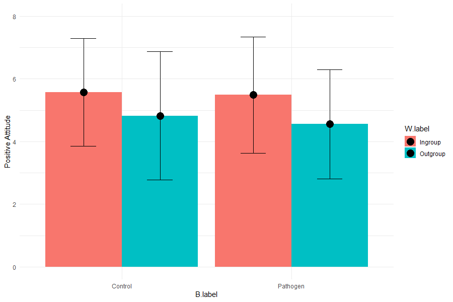
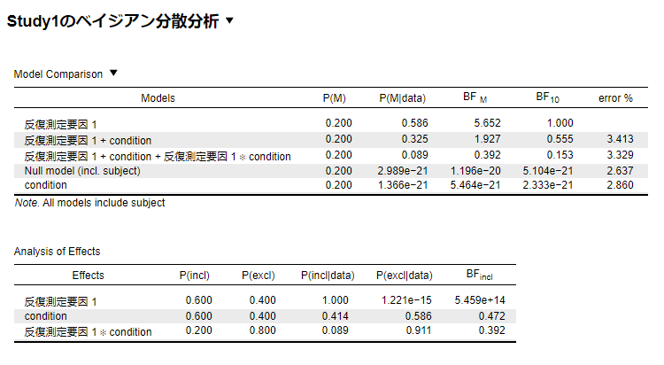
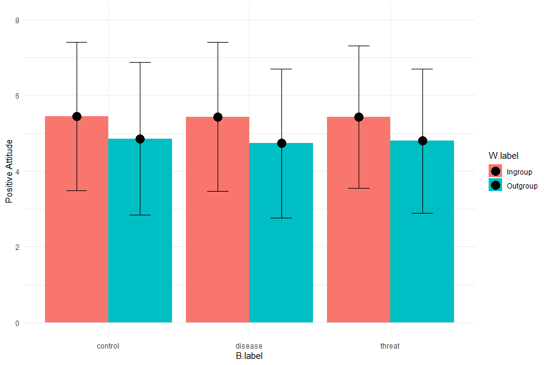
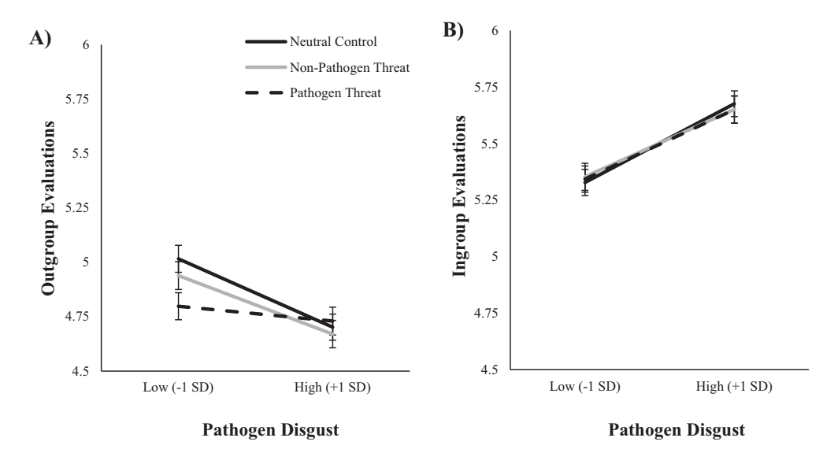
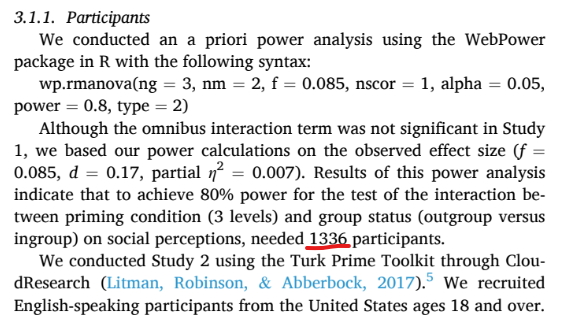
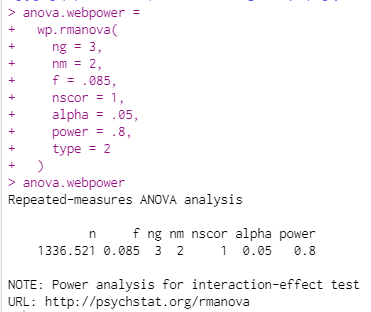

<!-- 
_class: title
headingDivider: 1
_paginate: false
 -->

 <!-- class: slides -->
# Makhanova et al. (inpress) のまとめ
## BISの適応度の使い方は適切か？

# 目次
<!-- _class: slides -->
- [はじめに](#はじめに)
- [Behavioral immune systemsとは？](#behavioral-immune-systemsとは)
- [BISの理論的批判](#bisの理論的批判)
- [実験結果](#実験結果)
- [高橋の感想と質問](#高橋の感想と質問)
  - [質問](#質問)
- [先生から頂きたいフィードバック(再掲)](#先生から頂きたいフィードバック再掲)
# はじめに
<!-- _class: section -->

# 前回の内容も踏まえた今回の目標
- DeepLを一切使わず読む
- 最低５本は引用されている文献を読む(最低でもabstract)
- 焦らず時間をかけて読む
  - わからないところは躊躇わず再読する

# 先生から頂いきたいフィードバック
前回同様、以下を念頭にお読みいただきたいです。最後のページにも再掲しております。
1. **お褒めの言葉**(先生に褒めていただけるからこそ頑張れます)
2. 主張やロジックに勘違いがないか？
   1. 今回はDeepLを使っていないため間違いの可能性大です
3. pathogen threat や BIS についてもっと調べたほうが良いか
4. 次回以降の資料に含めたほうが良い項目や内容
# Behavioral immune systemsとは？
<!-- _class: section -->

# Behavioral immune systemsとは？
Behavior immune systems (BIS)とは、
「個人が環境中の病原体を検知し、これらの病原体が体内に侵入するのを防ぐ行動を動機付けることを可能にする心理的メカニズムの集合体」(van Leeuwen & Petersen, 2018)のことである。

# BISの特徴
集団の同質性に関する理論は、なぜ社会集団は決裂しているのかを説明している。
特にBISは、人には新しい病原菌を忌避するための行動的な免疫システムがあり、具体的には
1. 集団間の相互作用は、新しい病原菌に感染するリスクを高める
2. 集団内の社会規範は、局所的病原菌の感染を低くする可能性

このような理由によって集団間バイアスは生じるのだと、BISは主張している。

# BISを支持する実験
さらに、assortative sociality理論を支持する結果は複数ある。(van Leeuwen & Petersen, 2018)
- 病原体嫌悪感度は、出身地不詳の移民と病原体の多い生態系からの移民両方が入国許可に対して負の影響を与えた(Ji et al., 2019)
- 嫌悪の感情との関連は、新しい病原菌の暴露＜反移民感情(Karinen et al., 2019)

# BISの理論的批判
<!-- _class: section -->
# BISの理論的批判
しかし、BISにはいくつかの問題がある
1. 祖先の環境では(新たな病原菌の可能性を持つ、よく知らない)外集団との交流は多くなかったはず
2. 集団内で誰かが感染すれば集団の殆どが感染するため、最小限の相互作用がある状況では外集団忌避に意味はないはず

すなわち、この理論は外集団忌避は、衛生の文化的習慣における集団間差異のために適応的だったとする可能性を排除していない。

# BISの仮説を支持しない実験
van Leeuwen & Petersen (2018)は、
- 実際の感染驚異(e.g. rash, lesion)は会話の居心地を減少させるものの、
- 異なる人種への態度変化(外集団忌避)は見られない

 ことを示した。

# これまでの研究の限界
- これまでの研究は特定の集団に関するステレオタイプを用いていた(e.g. Ji et al., 2019)。
- そのため、ある集団が特定の集団にどんな偏見を持っているのかを示しているに過ぎなかった。

BISが正しいならば、たとえ存在しない集団であっても、病原菌の暴露をプライムされることで偏見は生じるはずである。

# 本研究の目的と方針、仮説
そこで、BISが既存の集団に対する偏見ではなく、意味のない外集団でもassortative socialityが促進されるかどうかを検討するため、最小集団実験パラダイムを用いる。
- もし、これで病原菌忌避のメカニズムが生じるなら、集団の同質性は高まるだろう。(BISの支持)
- もし、これで病原菌忌避のメカニズムが生じないなら、集団の同質性は変わらないだろう。(BISの不支持)

# 大まかな方法(Study1, 2)
1. 性格の質問紙に回答してもらう。
2. その後、5分間写真を見せる操作を実施
  -  病原菌忌避条件では、感染した人の写真
  -  コントロール条件では、ニュートラルな住宅の写真
3. 質問紙を元に割り振る（実際はランダム）
   - Orenge team と green team
4. 最後に それぞれの集団を評価

# 実験結果
<!-- _class: section -->

# S1:病原菌プライムと統制に有意差なし

# ちなみに…S1のベイズファクターは微妙

# S2:病原菌でない嫌悪プライムでも同様

# S2: 病原菌嫌悪レベルの主効果のみあり

# 補足
S1:最小集団実験の操作は成功した(i.e. 個人タイプ評価と割り当てられたタイプの交互作用が有意)ものの、実験操作(pathogen vs. control)と評価(outgroup vs. ingroup)に交互作用効果なかった

S2:病原菌忌避と集団間バイアスの交互作用(Study 1の検出力でサンプルサイズを決定しても)は見られなかった。
単語のポジティブさ評価でも、よく知っているかどうかの主効果はあったが、操作(pathogen vs. non-pathogen vs. control)の主効果はなし。刺激の生態学的妥当性が低かったからかもしれないが…

# 結論
（最小条件集団実験において）病原菌のプライミングを行っても、社会の同質性は生じなかった。
そのため、**BISは理論的に妥当でない可能性**

※病原菌脅威が集団間バイアスを起こす可能性を除外したわけではない。

# 高橋の感想と質問
<!-- _class: section -->

# 進化に進化ゲーム理論は必須じゃない
進化ゲーム理論に基づかなくても、「進化じゃない」と批判できる
- この論文では、実証実験と背景を根拠として扱っていた
- 特にvan Leeuwen & Petersen (2018)の内容を参考にした模様
  - van Leeuwen & Petersen (2018)論文でも、進化ゲーム理論の話は出てこない
  - BISに対する批判を実証実験で示した論文

# 理論を批判するのに必要なこと
- 理論を批判するためには、批判する理論を支持する結果やロジックを熟知しなければならない
  - Navarrete et al. (2004)も、それ一本を読めばTMTの概要が理解できるほどだった
- Navarrete et al. (2004)もMakhanova et al. (inpress)も、理論の理解だけで終わっていない
  - 支持する実証研究も精査し、別解釈も提案

良い研究というのは、深い仮説と根拠があるなと実感しました…

# 理論を批判する大変さ
想定される批判を回避するのは並大抵のことではない
- 検出力の小ささを言うだけで終わらず、サンプルサイズを設計して調査
- 結果が妥当となるような実験刺激(本論文では嫌悪刺激と単語)は批判の決め手

すでにある納得しておくことが最も楽なのに、それを丁寧に批判するというのは、本当にすごい

# 方法論を理解しておくことの重要性
方法論に精通し、刺激のストックをためておくことが重要
- Study1データでBFを求めても帰無仮説を支持する値は出ない
  - 私なら、「BFがいまいちなら危険だ。他の要因を検討したほうがいい」と思ってしまう
  - でも、検出力分析を使えば批判を受け入れた上で反論可能
- 「要因Aではなく、要因Bである」という刺激は、実験のMethodを多く知らないと出てこない
  - 本研究では病原菌プライムvs.病原菌でない嫌悪プライム

# 自分の英語力の低さ
DeepLなしだと相当きつい
- Introductionは2回読んだが、2回とも解釈が異なった
- 1ページ読むのに60分ほどかかった
- それでも、論文を英語で読むことに対するハードルは下がった

テクノロジーの素晴らしさと、文脈を読めることの重要さがわかりました

# 質問
論文で出たサンプルサイズは1336ではなく1337が正しいですが…連絡とかしたほうがいいですか…？
次からの2ページに論文の記述と実際のRの分析を載せてます。
- nの小数の値切り上げるのが正しいです
- この間違いが、論文の価値を変えることはないです
  - 実際のS2の分析サンプルは1339なので

# Makhanova et al. (inpress)の記述

# 私のRの結果

# 以上です
<!-- _class: section -->
# 先生から頂きたいフィードバック(再掲)
1. **お褒めの言葉**(先生に褒めていただけるからこそ頑張れます)
2. 主張やロジックに勘違いがないか？
   1. 今回はDeepLを使っていないため間違いの可能性大です
3. pathogen threat や BIS についてもっと調べたほうが良いか
4. 次回以降の資料に含めたほうが良い項目や内容

<!-- 以下、CSSコード -->

